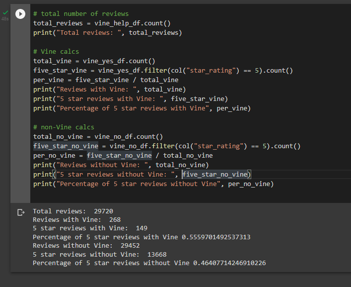

# Amazon_Vine_Analysis

## Overview
The purpose of the analysis was to determine if there is any bias in Amazon product reviews from customers that also were included in the paid Vine program.

The analysis was performed on the Tools dataset from the provided S3 AWS bucket. The data were extracted, transformed and loaded using Google Colab and pySpark. The data tables were then written to the postgres tables using AWS RDS. 

The analysis to then determine any bias was completed in pySpark.

## Results
Only review identifications with greater than 20 total votes were used. The results of the analysis are:

+ There are 149 5 star Vine reviews out of 268 total Vine reviews.
+ 56% of Vine reviews are 5 star.
+ There are 13,668 5-star non-Vine reviews out of 29,452 total non-Vine reviews.
+ 46% of non-Vine reviews are 5 stars.

## Summary
The results above show that, based on the percentage of 5 star Vine reviews being 56% and 5 start non-Vine reviews being 46%, that there may be a bias in Amazon tools product reviews from customers that are also included in the Vine program. However, similar analysis for additional product sub-sets should be compiled along with tools to determine the extent of the observed potential bias.

Additional analysis could be completed to investigate the bias toward products of the same brand from customers participating in the Vine program but for other distinct products. This would help identify the extent of the Vine bias beyond just the reviews for the directly paid  for products.